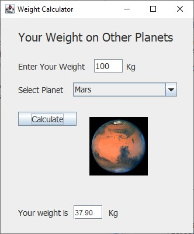
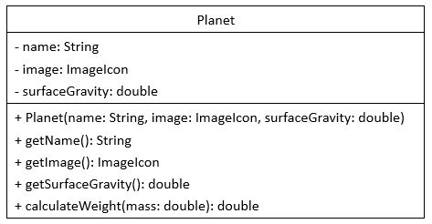
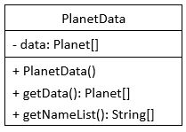

# Lab2: Your Weight on Other Planets

## Objectives

- Review the basic object-oriented concepts: class and class instantiation.
- Learn how to create classes and objects in Java.

## Work

1. Go to your work space.
2. Download the Lab2 folder.

        $ git clone https://github.com/UNHM-2023-Fall-COMP-730-830/Lab2.git

3. Go to Lab2_Work.
4. Review Lab2.java, which includes `main()`. You don't need to make any changes to this file.
5. Complete the `Planet` class in the `Planet` file.

* The weight is calculated by mass * surfaceGravity.

6. Complete the `PlanetData` class in the `PlanetData` file.

* Use the following name, image and surfaceGravity (g) for the planets:

| name | image | surfaceGravity |
|---|---|---|
| Mercury | mercury.gif | 0.377 |
| Venus | venus.gif | 0.905 |
| Moon | moon.gif | 0.1654 |
| Mars | mars.gif | 0.379 |
| Jupiter | jupiter.gif | 2.528 |
| Saturn | saturn.gif | 1.065 |
| Uranus | uranus.gif | 0.886 |
| Neptune | neptune.gif | 1.137|
| Pltuto | pluto.gif | 0.063 |

* Use image with `new ImageIcon("../Lab2_Images/planet.gif")`.

---
End of Lab2
